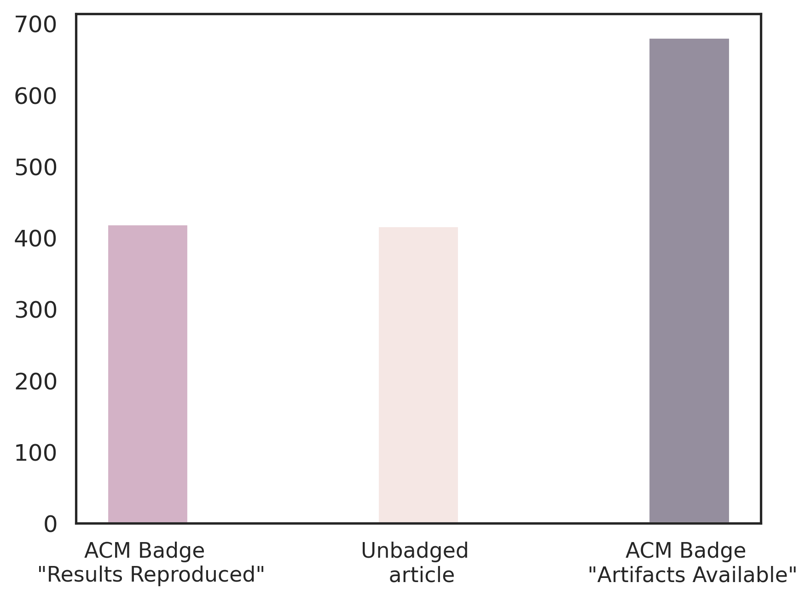

## Badged and Unbadged dataset
The study focuses on collecting badged articles from ACM digital library to further enhance our understanding about reproducibility in computational sciences at large. To that extent, the repository structure includes `badged/` and `unbadged/` directories to specifically look at those categories of the data. Alternatively, the complete dataset with feature information is available in the file `ACM_REP22_badged_unbadged.csv`.

## Description
ACM digital library has introduced badges to signal when publications have been successfully reproduced. Articles are badged as **Artifacts Available** when they are accompanied with artifacts that have been rendered permanently retrievable, whilst **Results Reproduced** is given when without the use of author-supplied artifacts, the primary findings of the publication have been independently obtained in a later investigation by a person or group other than the authors. We gathered 744 articles that are badged as Artifacts Available and 528 articles that are badged as Results Reproduced. We compiled a collection of scholarly articles, **Unbadged**, that are part of the ACM but do not have any association with the badging process, and all articles are devoid of any badging status. The only precursor these articles have is that they are part of ACM and hail from the same conference or journal and from the same year as the ACM badged “Results Reproduced” articles. In total, 465 articles belong in this category. Post processing the data and removing rows without information resulted in a final tally of 1673 articles, of which 680 belonged to Artifacts Available, 528 belonged to Results Reproduced, and 465 articles were Unbadged.

The ACM digital library is a valuable place to source article level information. The dataset we built consisted of the following aspects:
- **Meta information** about the article. This includes author’s name, title, DOI, year, volume, and issue.
- **Full text information** about the article. This includes Presence of Introduction, Presence of Methodology, Presence of Results, Number of Images, Tables, Equations, and Algorithms.
- **Scholarly information** about the article. This includes Google Scholar citations and h-index of the authors.
- **Miscellaneous**. The information includes Presence of Supplemental Information, Presence of Hyperlink to Codebase, Availability of funding information, and Acceptance rate availability.

The Meta information, and Scholarly information was obtained by systematically extracting information from the digital library and Google Scholar. We used python software libraries such as urllib3, Beautiful Soup, and BibtexParser to achieve this goal. To obtain Full text information, we have utilized Allen-AI’s Science Parse(https://pypi.org/project/science-parse-api) software package to parse every sections of the full-text document (downloaded as PDFs) into a structured form. Miscellaneous information was obtained after using regular expressions and string manipulations to analyze the already extracted data from the digital library.

